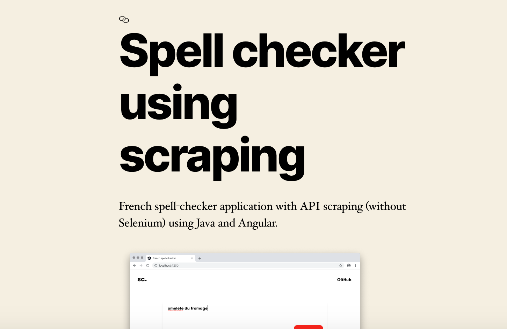

<p align="center">
  
</p>
<h1 align="center">
  Import GitHub Readme (WordPress plugin)
</h1>

<p align="center">
  Import a Readme from GitHub within a post
</p>

## How to use
Put this shortcode into the post :
```txt
[github-readme link="<REPO_OWNER>/<REPO_NAME>"]
```

## Example


```txt
[github-readme link="ilies-t/spell-checker-using-scraping"]
```
### Result in post page:


# Errors
Errors are always displayed in the JavaScript console

# Licence
[Apache License 2.0](https://choosealicense.com/licenses/apache-2.0/)